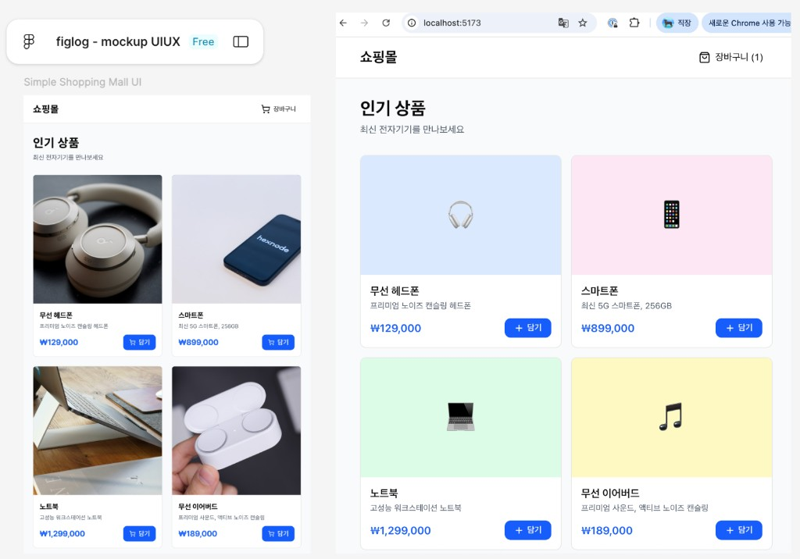
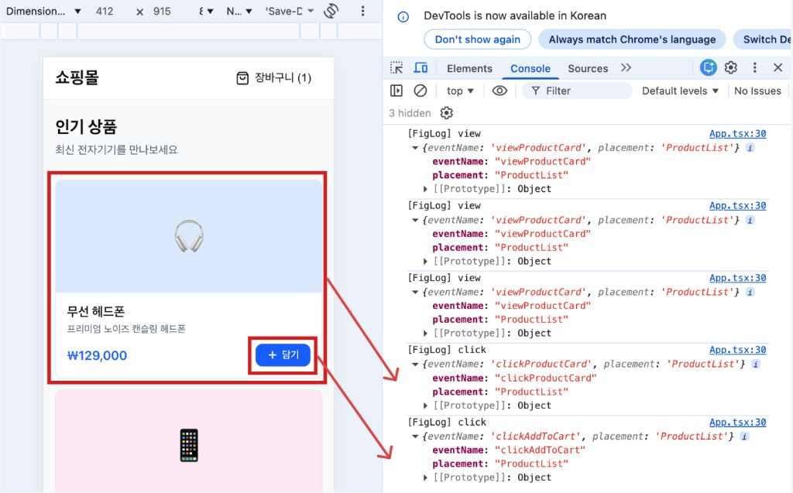
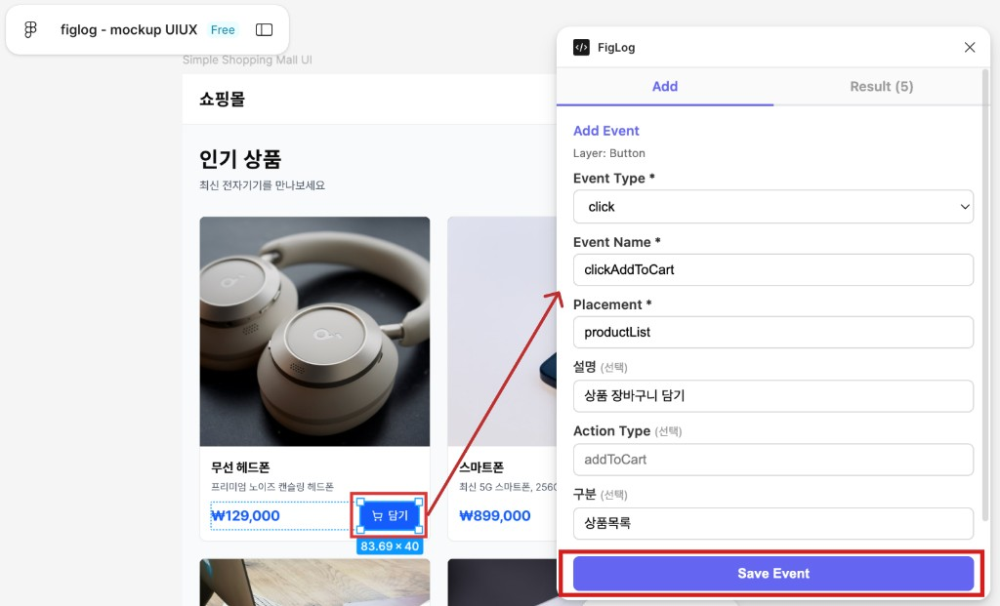
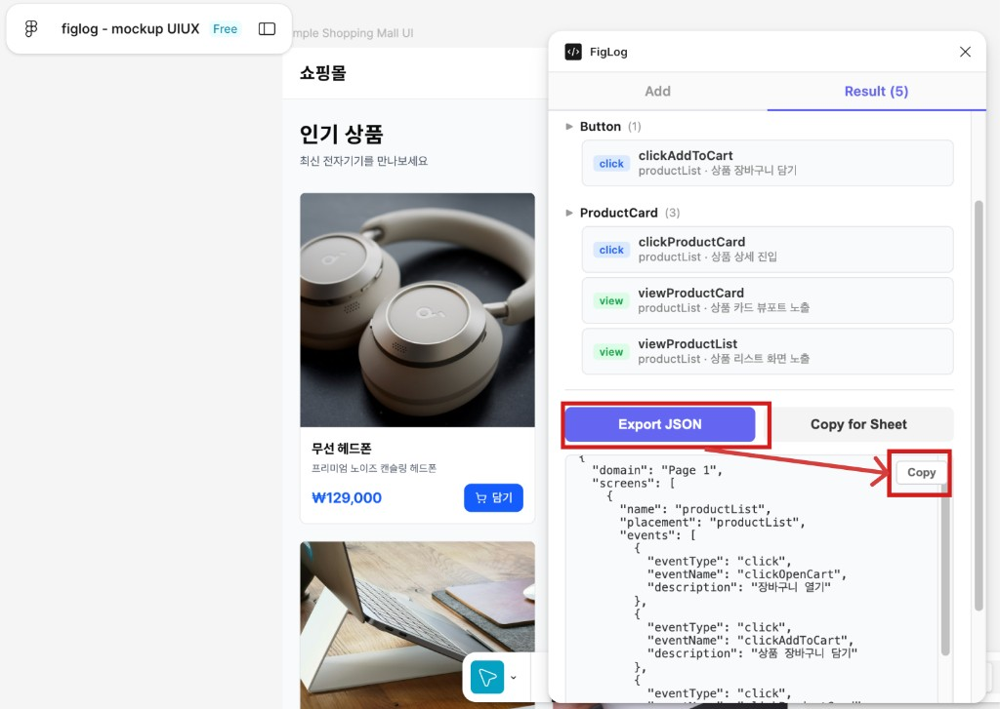
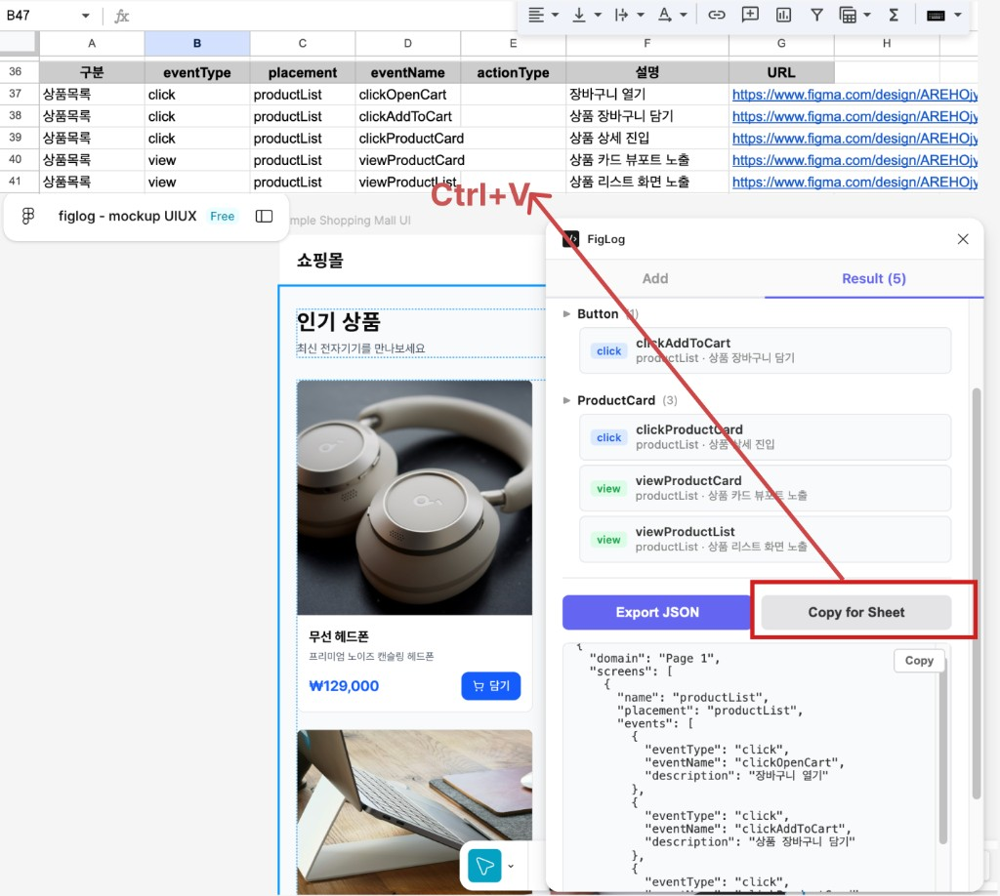

[한국어](./README.md) | **English**

# FigLog

End-to-end declarative logging pipeline: **Figma → JSON spec → build-time injection → runtime auto-collection**.

<div align="center">
  
</div>

## How It Works

```
DA marks logging points in Figma → JSON spec exported
  → Developer adds data-log attributes (or AI does it from the spec)
  → Vite plugin injects component/folder metadata at build time
  → useAutoLog hook auto-collects click & view events at runtime
```

<div align="center">
  
  <p><em>Runtime event collection by the useAutoLog hook</em></p>
</div>

## Packages

| Package | Description |
|---|---|
| [`@figlog/schema`](./packages/schema) | Shared TypeScript types and JSON schema for logging specs |
| [`@figlog/vite-plugin`](./packages/vite-plugin) | Vite plugin that injects `data-log-component` and `data-log-folder` at build time |
| [`@figlog/runtime`](./packages/runtime) | `useAutoLog` React hook for automatic event collection |
| [`@figlog/figma-plugin`](./packages/figma-plugin) | Figma plugin for DA to mark logging points and export specs |

## Quick Start

### 1. Install

```bash
pnpm add @figlog/runtime
pnpm add -D @figlog/vite-plugin
```

### 2. Configure Vite

```typescript
// vite.config.ts
import autoLog from '@figlog/vite-plugin'

export default defineConfig({
  plugins: [autoLog({ folderDepth: 1 })],
})
```

### 3. Add the Hook

```tsx
// App.tsx
import { useAutoLog } from '@figlog/runtime'

function App() {
  useAutoLog({
    domainMap: { shop: 'OnlineShop' },
    onLog: (eventType, payload) => {
      myAnalytics.track(eventType, payload)
    },
  })

  return <ProductListScreen />
}
```

### 4. Mark Elements

```tsx
<div data-log-screen="productList">
  {/* DA-defined event (with data-log-id) */}
  <Button data-log="click" data-log-id="addToCart">
    Add to Cart
  </Button>

  {/* Auto-generated event name (no id) */}
  <Button data-log="click">View Details</Button>

  {/* View event - fires when element enters viewport */}
  <Banner data-log="view" data-log-id="orderComplete">
    Order Confirmed!
  </Banner>
</div>
```

## HTML Attributes

| Attribute | Injected By | Description |
|---|---|---|
| `data-log` | Developer | `'click'` or `'view'` |
| `data-log-id` | Developer | DA-defined event ID (omit for auto-generated name) |
| `data-log-screen` | Developer | Screen identifier (used for placement) |
| `data-log-component` | Build-time (auto) | Extracted from file name |
| `data-log-folder` | Build-time (auto) | Extracted from folder name |

## Event Name Generation

| Mode | Condition | Pattern | Example |
|---|---|---|---|
| DA-defined | `data-log-id` present | `{action}{Domain}{Id}` | `clickOnlineShopAddToCart` |
| Auto-generated | No `data-log-id` | `{folder}.{component}.{action}` | `shop.ProductList.click` |

## Figma Plugin

<div align="center">
  
  
</div>

<div align="center">
  
  <p><em>Copy for Sheet → paste directly into Google Sheets</em></p>
</div>

## Development

```bash
# Install dependencies
pnpm install

# Build all packages
pnpm build

# Run example app
cd examples/react-app && pnpm dev
```

## License

MIT
